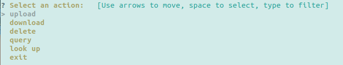
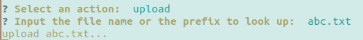
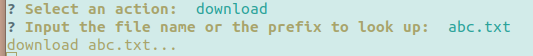
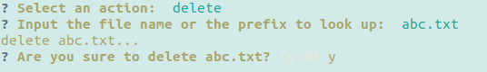
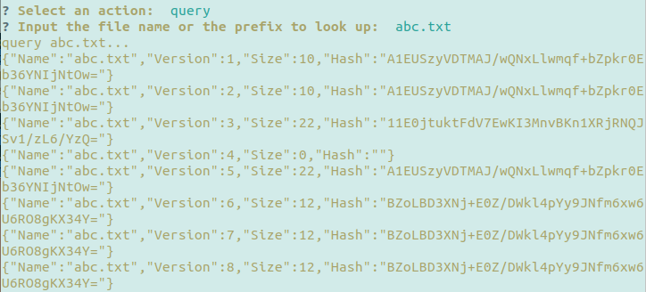
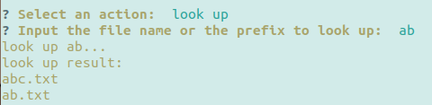

# 使用文档

### 代码目录组成：

+ go： 本项目使用的golang语言所依赖的库
+ Source：本项目源代码，目录下的子文件夹说明如下：
  + apiServer：接口服务器代码。
  + dataServer：数据服务器代码。
  + deleteGarbega：定期清理垃圾箱中对象的代码。
  + deleteOldMetadata：清理超出版本数量限制的元数据。
  + deleteOrphanObject：清理无元数据引用的对象数据。
  + interaction：提供的易用的命令行交互工具。
  + objectScanner：定期数据修复的代码。
  + 剩下的是单机测试程序的代码，其中mapping.json是elasticsearch组件需要的元数据映射。
+ Dockerfile-\*：分别是构建接口服务器镜像、数据服务器镜像、元数据服务器镜像、消息队列镜像的docker文件。
+ *.sh：部署时常用的指令

### 环境：

服务器端

+ Ubuntu18.04

+ Golang

+ Elasticsearch >= 7.0.0

+ Rabbitmq

+ tar

+ sudo

+ docker（单机部署不需要）

  Golang、Elasticsearch、Rabbitmq的安装方法见这些项目的官网。

客户端

+ curl
+ tar（使用客户端工具时需要）

### 单机部署方法：

+ 将go文件夹下的全部文件夹放入$GOPATH指定的目录中。

+ 进入Source文件夹中

  先启动elasticsearch服务，创建数据服务器要使用的文件夹，配置虚拟IP以及创建元数据服务器所需的映射。

  ```she
  ./config.sh
  ```

  再启动全部服务器

  ```shell
  ./config.sh
  ```

  停止服务

  ```shel
  ./stop.sh
  ```

  清理数据、元数据

  ```she
  ./clean.sh
  ```

  重启服务

  ```shell
  ./restart.sh
  ```

### Docker部署方法

+ 拉取ubuntu18.04镜像

  ```shell
  docker pull ubuntu18.04
  ```

+ 使用各个dockerfile配置相应镜像

+ 配置bridge网桥

  ```shell
  ./config.sh
  ```

+ 按照./start.sh中的方法启动容器，注意配置IP以及网桥中的网络别名

+ 按照./stop.sh中的方法停止容器


### 使用方法：

#### RESTful风格的http接口

- 上传

  ```go
  curl -XPUT API_SERVER_IP:API_SERVER_PORT/objects/OBJECT_NAME -T OBJECT_NAME -H ”Digest: SHA-256=SHA256_BASE64_HASH"
  ```

- 下载

  ```go
  curl -XGET API_SERVER_IP:API_SERVER_PORT/objects/OBJECT_NAME -o TARGET_NAME
  ```

- 版本查询

  ```go
  curl API_SERVER_IP:API_SERVER_PORT/objects/OBJECT_NAME/versions/
  ```

- 文件删除

  ```go
  curl -XDELETE API_SERVER_IP:API_SERVER_PORT/objects/OBJECT_NAME
  ```

- 快速搜索

  ```go
  curl API_SERVER_IP:API_SERVER_PORT/objects/OBJECT_NAME/lookup/
  ```

#### 命令行交互工具

运行Source/interaction/interaction.go，进入命令行工具界面

```shell
go run Source/interaction/interaction.go
```



上传文件：



下载文件：



删除文件：



查询文件版本：



快速查找文件：




